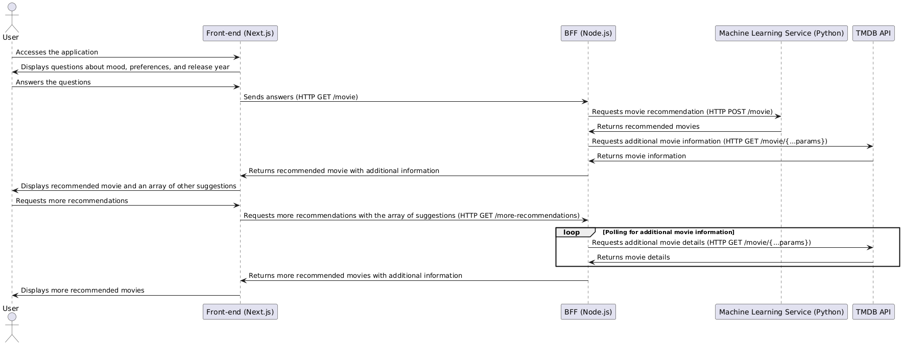

# What to watch tonight? Version 1

A movie recommendation system based on machine learning. It uses clustering to group similar movies based on their genres and release year. Recommendations are made based on the most frequent clusters of the specified genres and mapped to the user's mood, within the provided decade.

## Table of Contents

<!-- - [Features](#features) -->
- [Overview](#overview)
- [Installation](#installation)
- [Local Usage](#local-usage)
- [Contributing](#contributing)
- [License](#license)
- [Contact](#contact)

## Overview

### Brief Summary
The system is composed of three layers: a graphical interface (front-end) developed in Next.js, a back-end for front-end (BFF) implemented in Node.js to manage requests from both the front-end and external APIs, and a clustering service in Python. In this initial version, the system uses a dataset with over 193,609 movies cataloged up to 2010.

### Front-end
Developed in Next.js, the front-end is designed for client-side rendering. It uses Context API to centralize all business logic. The interface presents five questions about mood, taste, and release year preferences. After answering all questions, a request is sent to the BFF, which validates the answers and fetches an appropriate result.

### BFF
The BFF, developed in Node.js, exposes HTTP routes using the Express framework. In addition to exposing routes, the project also acts as a client, using Axios to communicate with the machine learning service to fetch a movie. After retrieving the movie, an additional call is made to the TMDB API (https://www.themoviedb.org/) to retrieve additional information, such as movie description and images.

### ML Service
This recommendation system uses clustering to group similar movies based on their genres and release year. Recommendations are made based on the most frequent clusters of the specified genres and mapped to the user's mood, within the provided decade.

### Sequence Diagram

### Some Considerations
As this is still a development project, there are practices that need to be corrected.

## Installation

To install the project locally, follow these steps:

1. Clone the three repositories:
2. Navigate to the project directories:
3. Install Node dependencies in the front-end and BFF, and Python dependencies in the ML service:
4. Change the environment variables and set the required values. To obtain the TMDB API Key, you can follow this documentation: https://developer.themoviedb.org/docs/getting-started. The `AUTHORIZATION_TOKEN` variable can be set to any value of your choice but must be the same in both the front-end and BFF layers.

## Local Usage

### Requirements

- Node 18.20.3
- Python 3+

When starting the project following the scripts for the front-end, BFF, and ML service, access the project at http://localhost:3000.

## Images

## Contributing
Contributions are welcome! Follow the steps below to contribute:

Here you will find the submodules; fork the layer you would like to contribute to.

## License
This project is licensed under the MIT License. See the LICENSE file for more details.

## Contact
- LinkedIn - https://www.linkedin.com/in/jonatha-follmer/
